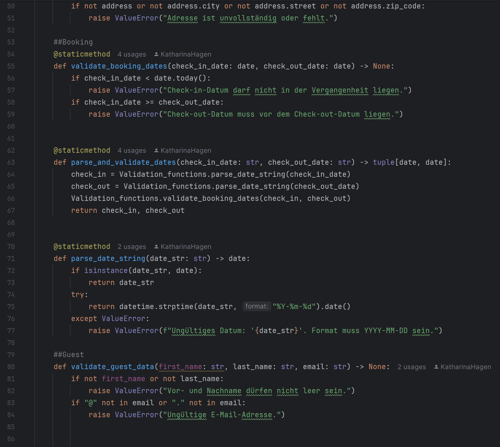
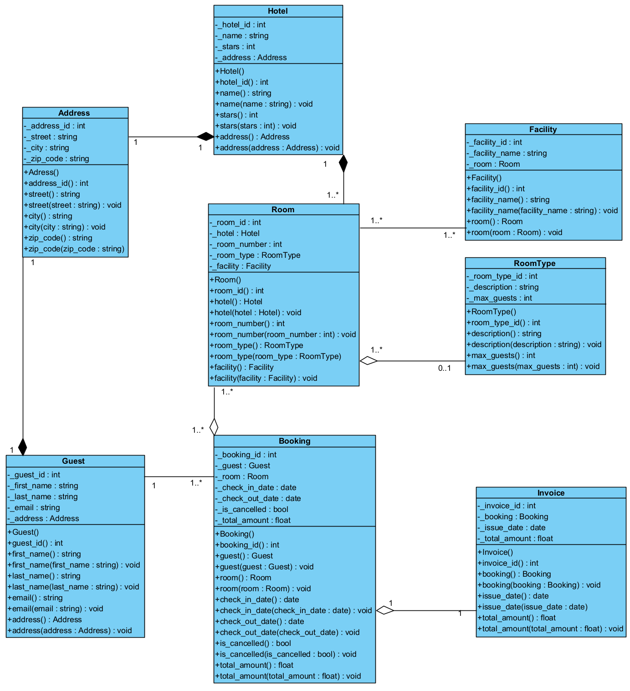
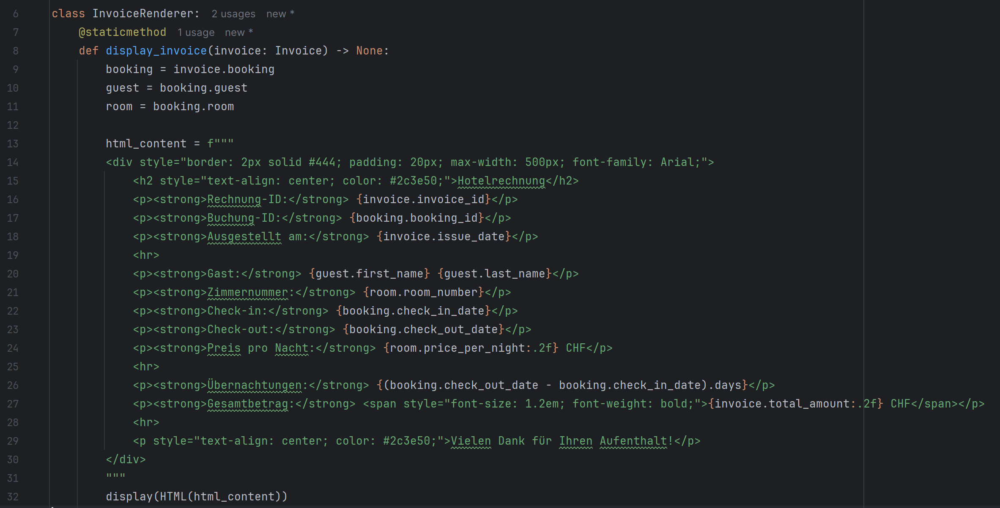

# Hotel Reservation System – AEP Projekt (FS2025)

## 🧾 Projektbeschreibung

Dieses Projekt wurde im Rahmen des Moduls *Anwendungsentwicklung mit Python* (AEP, FS2025) an der Hochschule für Wirtschaft FHNW umgesetzt.  
Ziel ist die exemplarische Implementierung eines Hotelreservierungssystems unter Einsatz moderner Python-Technologien, modularer Softwarearchitektur und relationaler Datenhaltung.

Das Projekt wurde vollständig mit PyCharm umgesetzt, inkl. Versionsverwaltung über GitHub. Eine Deepnote-Integration wurde nicht verwendet
> **Abstract:**  
Diese Arbeit demonstriert, wie sich reale Geschäftsprozesse – dargestellt durch User Stories – systematisch in Codestrukturen überführen lassen. Zum Einsatz kommen objektorientierte Programmierung, relationale Datenbanken (SQLite), Schichtentrennung (N-Tier Architektur) sowie Tools zur Visualisierung und PDF-Ausgabe.

🎥 [Hier klicken, um unsere Projektpräsentation anzusehen](https://link-zu-eurem-video)

> In diesem Video demonstrieren wir unsere Lösung wie in einer Live-Präsentation.  
> Wir zeigen exemplarisch zwei ausgewählte User Stories, die wir besonders gelungen finden, und erklären dabei jeweils die dahinterliegende Logik und den Code.  
> Zudem erläutern wir abwechselnd verschiedene Aspekte des Projekts, insbesondere unsere jeweiligen Beiträge.  
> Beide Teammitglieder sind in der Präsentation zu sehen.

---

## 👤 Rollen

### 👩‍💻 Daliah Beck  
**Rolle: Architektur, Datenmodellierung, Datenzugriff, Geschäftslogik, Dokumentation**

Daliah war verantwortlich für die technische Grundlage und den Aufbau des Hotelreservierungssystems. Ihr Fokus lag auf der initialen Projektstruktur, der Implementierung der Datenmodelle, dem Datenbankzugriff, zentraler Geschäftslogik sowie der vollständigen schriftlichen Dokumentation.

**Beiträge (basierend auf Commit-Verlauf):**

- **Projektsetup & Infrastruktur:**
  - Initialisierung des Repositories (`initial commit`, `.gitignore`, `requirements.txt`, Ordnerstruktur)
  - Einbindung und Organisation der SQLite-Datenbanken (`working_db.db`, `Script.sql`)
  - Git-Konfiguration für sauberen Workflow


- **Modellierung & Datenstruktur:**
  - Erstellung aller Model-Klassen (`Guest`, `Hotel`, `Room`, `Booking`, `Invoice`, `Facility`, `RoomType`)
  - Einbindung von Beziehungen entsprechend dem UML-Diagramm (inkl. Komposition/Aggregation)


- **Data Access & SQL:**
  - Entwicklung und Strukturierung sämtlicher `*_data_access.py`-Dateien
  - Zentrale SQL-Abfragen und Hilfsfunktionen in `SQL.py`
  - Verarbeitung hotel- und zimmerbezogener Daten über strukturierte SQL-Logik


- **Business Logic Layer:**
  - Aufbau der Geschäftslogik-Komponenten:
    - `invoice_manager.py`
    - `booking_manager.py`
    - `room_manager.py`
    - `room_type_manager.py`
  - Implementierung erweiterter Abläufe wie Rechnungslogik, Validierungen, Datenroutinen
  - User Story 5 & 6 


- **Zusätzliche Features & Utility:**
  - Implementierung von `email_sender.py` zur optionalen Buchungsbestätigung per E-Mail
  - Anpassung und Strukturpflege der Utility-Funktionen (`utils/`)


- **Fehlerbehandlung & Konfliktlösung:**
  - Commit am **26.05.2025**: Lösung von Merge-Konflikten und Integration von Hotfixes
  - Verbesserung der Abfragen für spezifische Hotels und Zimmerzuordnung


- **Dokumentation:**
  - Verfasserin der **README.md-Dokumentation**


### 👩 Katharina Hagen  
**Rolle: User Stories, UI/UX, Testing, Versionskontrolle, CLI-Interaktion**

Katharina war für die iterative Entwicklung der User Stories, die Gestaltung der Benutzerführung sowie für Eingabelogik, Testing und Repository-Pflege zuständig. Sie arbeitete kontinuierlich an der Verbesserung der funktionalen Abläufe und sorgte für eine konsistente Ausführung der Anforderungen in der CLI.

**Beiträge (basierend auf Commit-Verlauf):**

- **User Stories (konzeptionell und technisch):**
  - Umsetzung, Überarbeitung und Verbesserung von:
    - **User Story 1–4** (Hotels anzeigen, filtern, Zimmerdetails, Buchung)
    - **Überarbeitung User Story 5 & 6** 
      → *siehe Commit „userstory 5 und 6 verbessert“ am 08.06.2025 – 18:48*
    - **User Story 7 & 8** (dynamische Preise, Buchungsübersicht)
    - **User Story 9 & 10** (Admin-Reports & Datenpflege)
    - Überarbeitung von **User Story 3** (08.06.2025 – 22:59)
  - Korrektur und Feinschliff von Eingabelogik & Datenabfragen im Rahmen dieser Stories


- **UI- & CLI-Interaktion:**
  - Gestaltung der Benutzerführung im CLI
  - Eingabevalidierung & Fehlerbehandlung über `Inputs.py` und eigene Utils
  - Umsetzung und Verknüpfung der Eingabeflüsse mit Business-Logik


- **Testing & Konfliktlösung:**
  - Wiederholtes Refactoring, Testing und Reviews während der Story-Phasen
  - Pflege des konsistenten Codes zwischen Modellierung, Datenzugriff und Logik
  - Merge-Koordination & Konfliktlösungen mit Pull Requests


- **Technische Unterstützung:**
  - Erweiterung von `sql.py` mit spezifischen Abfragen (z. B. Zimmerfilter)
  - Unterstützung bei der Modellintegration & Datenbankabgleich (`model: guest, hotel, room` etc.)

### Präsentation und Coaching

- **Tutorials / Demo** – Daliah Beck, Katharina Hagen  
- **Coaches (extern)** – Charuta Pande, Phillip Gachnang

---

## 🛠️ Tools & Technologien

- **Python 3.10+** – Hauptsprache der Applikation
- **SQLite** – lokale relationale Datenbank
- **pandas** – Verarbeitung tabellarischer Daten (z. B. Rechnungsdetails, Gästeauswertung)
- **matplotlib** – visuelle Darstellung (z. B. Zimmerauslastung, Umsatztrend)
- **fpdf** – Erzeugung von PDF-Buchungsbestätigungen
- **Jupyter Notebook** – explorative Datenanalyse und Funktionsdemos
- **Visual Paradigm** – UML-Klassendiagramm (Designphase)

---

## 🧠 Verwendete Konzepte & Python-Prinzipien

In der Umsetzung unseres Hotelreservierungssystems haben wir gezielt auf sauberen, wartbaren und idiomatischen Python-Code geachtet. Dabei kamen zahlreiche zentrale Programmierkonzepte und -prinzipien zum Einsatz, die wir im Folgenden strukturiert darstellen:

### ✅ Funktionen & Strukturprinzipien

- **Funktionen mit und ohne Rückgabewert**  
  Zentrale Logik wurde über modularisierte Funktionen umgesetzt:  
  z. B. `create_guest()`, `cancel_booking()`, `validate_city()` (in `guest_manager.py`, `validation_functions.py`).


- **Parameter & Default Values**  
  → `search_hotel_print_rooms(city, check_in_date=None, ...)` erlaubt flexible Funktionsaufrufe mit optionalen Parametern.


- **KISS & DRY-Prinzipien**  
  → Die **Validierungslogik** wurde in einer eigenen `validation_functions.py` ausgelagert.  
  → Durch zentrale Managerklassen und Utility-Methoden vermeiden wir Wiederholungen und halten den Code klar und verständlich.

---

### ✅ Kontrollstrukturen

- **if/elif-Logik**  
  → Häufig verwendet z. B. in der Benutzerführung (`if buchung == "nein": ... elif ...`)  
  → Besonders prominent in `main.py` und CLI-Menüs.


- **Loops (for)**  
  → Iteration über Hotels, Zimmer und Buchungen (z. B. `for h in hotels:`).  
  → Einsatz z. B. in `hotel_manager.py`, `booking_manager.py`.

---

### ✅ Datenstrukturen & Typen

- **Listen & Dictionaries**  
  → Hotel-Listen, Buchungsübersichten etc. werden als `list[Hotel]`, `dict` strukturiert geführt.  
  → `hotels_dict[hotel_id] = hotel` – für schnelles Mapping.


- **Tuples & Rückgabewerte**  
  → Verwendung von `(check_in, check_out)` als strukturierte Rückgabewerte.


- **List Comprehension**  
  → z. B. `active_bookings = [b for b in bookings if not b.is_cancelled]`

---

### ✅ Objektorientierung & Architektur

- **Klassen & Objekte**  
  → Umsetzung der zentralen Entitäten als OOP-Klassen (`Room`, `Hotel`, `Guest`, `Booking`, `Invoice`).


- **Kapselung & Data Hiding**  
  → Zugriff über Getter/Setter, interne Zustände durch `__` und `_` geschützt.  
  → Z. B. `self._booking_da`, `self.__room_id`.


- **Vererbung & Polymorphismus**  
  → `BookingDataAccess(BaseDataAccess)` erbt und überschreibt Methoden (z. B. `fetchall()`).


- **Aggregation / Komposition / Assoziation**  
  → `Hotel` aggregiert `Address`, `Room` kompositionell mit `RoomType`, `Booking` assoziiert `Guest` und `Room`.

---

### ✅ Fehlerbehandlung

- **try/except-Blöcke**  
  → Robustheit durch saubere Fehlerbehandlung beim Datenbankzugriff, Input Parsing, Rechnungslogik.  
  → Z. B. `ValueError`, `traceback.print_exc()` zur Nachvollziehbarkeit.

---

### ✅ Datenzugriff & Datenbanklogik

- **SQLite-Integration**  
  → Alle CRUD-Operationen in `*_data_access.py` über `sqlite3`.  
  → Strukturierte Queries in `booking_data_access.py`, `hotel_data_access.py`.


- **Kontextmanagement & File Handling**  
  → `shutil.copyfile(...)` zur DB-Initialisierung, `with`-Kontext für Datenbankverbindungen.

---

### ✅ Visualisierung & Analyse

- **Pandas**  
  → Tabellenanzeige im Admin-Modul, z. B. Buchungsübersichten.


- **Matplotlib (User Story 9 & 10)**  
  → Diagramme für Zimmertyp-Nutzung und Umsatztrends.

---

### 🔎 Fazit: Codequalität & Prinzipientreue

Unser Projekt orientiert sich bewusst an **Best Practices der Softwareentwicklung**. Besonders hervorzuheben:

- **DRY (Don't Repeat Yourself)**  
  → Wiederverwendbare Managerklassen und Validierungslogik.


- **KISS (Keep It Simple, Stupid)**  
  → Klare Methoden mit Einzelverantwortung, keine überkomplizierten Abhängigkeiten.


- **Saubere Trennung der Ebenen**  
  → `model/`, `data_access/`, `business_logic/`, `ui/` – konsequent strukturiert.

> Damit demonstriert das Projekt nicht nur die Umsetzung der geforderten Funktionalitäten, sondern auch ein solides Verständnis moderner Python-Entwicklung im Sinne der Clean Code Prinzipien.

---

## ✅ Validierung als architektonisches Prinzip – Rolle der `validation_functions.py`

Ein zentrales Qualitätsmerkmal unseres Systems ist die **systematische Entkopplung von Validierungslogik und fachlicher Geschäftsverarbeitung**. Dieser Anspruch manifestiert sich exemplarisch in der Datei `validation_functions.py`, die als zentrale Anlaufstelle für alle Eingabevalidierungen dient. Die Auslagerung in ein dediziertes Modul folgt nicht nur dem Prinzip der Wiederverwendbarkeit, sondern optimiert Wartbarkeit, Lesbarkeit und Fehlertoleranz im gesamten Codebestand.

### 🔍 Vorteile auf Systemebene

| Vorteil                           | Beschreibung |
|----------------------------------|--------------|
| **Wiederverwendbarkeit**         | Funktionen wie `validate_guest_data()` oder `parse_and_validate_dates()` sind universell einsetzbar – z. B. in `BookingManager`, `GuestManager` oder UI-Komponenten. |
| **Reduktion von Redundanz (DRY)**| Durch Zentralisierung werden doppelte Validierungslogiken vermieden und die Kohärenz über Module hinweg gewährleistet. |
| **Saubere Trennung (Separation of Concerns)** | Die Geschäftslogik bleibt schlank, da Prüfungen nicht in Manager- oder UI-Schichten eingebettet sind. |
| **Fehlertoleranz & Debugging**   | Einheitlich strukturierte Fehlerausgaben (z. B. `ValueError`) erleichtern Identifikation und Behebung von Nutzungsfehlern. |
| **Konsistente Nutzerführung**    | Benutzer erhalten standardisierte, verständliche Rückmeldungen – unabhängig davon, wo die Eingabe erfolgte. |

### 🧠 Eingesetzte Programmierkonzepte

Die Architektur der Validierungslogik basiert auf bewährten Prinzipien moderner Softwareentwicklung:

- **Funktionen mit/ohne Rückgabewert**:  
  Beispiel: `validate_name()` prüft ausschliesslich, während `normalize_city()` einen bereinigten String zurückliefert.


- **Typisierte Rückgaben & Tuples**:  
  `parse_and_validate_dates(...) → tuple[date, date]` erhöht die Lesbarkeit und Typensicherheit.


- **Fehlerbehandlung via `try/except`**:  
  Fehlerhafte Benutzereingaben lösen gezielte `ValueError`-Ausnahmen aus, die im Manager oder der UI-Schicht kontrolliert behandelt werden.


- **Kapselung & Modularität**:  
  Die Validierungen sind bewusst außerhalb der UI- und Logikebenen platziert, wodurch eine hohe Wiederverwendbarkeit und Austauschbarkeit gewährleistet ist.


- **KISS-Prinzip (Keep It Simple, Stupid)**:  
  Jede Funktion erfüllt exakt eine klar abgegrenzte Aufgabe – z. B. nur Datum validieren oder PLZ prüfen – und folgt dabei einer schlanken Methodensignatur.


- **Defensive Programmierung**:  
  Durch frühzeitige Abfangmechanismen wird sichergestellt, dass fehlerhafte Eingaben das System nicht in instabile Zustände bringen.


- **Testbarkeit & Dokumentierbarkeit**:  
  Die klar benannten Funktionen ermöglichen zielgerichtetes Unit-Testing und tragen zu einem dokumentierten, nachvollziehbaren Codebase bei.



> **Abstract:** 
> Die Datei `validation_functions.py` stellt damit nicht nur ein technisches Hilfsmittel dar, sondern verkörpert in ihrer Struktur und Funktion ein Schlüsselelement guter Softwarearchitektur: Sie unterstützt ein robustes, testbares und skalierbares Systemdesign – ganz im Sinne moderner Python-Entwicklung und professioneller Codequalität.

---

## 🧠 Architektur (N-Tier Modell)

Die Applikation folgt einer **mehrschichtigen Architektur (N-Tier)** zur logischen Trennung und besseren Wartbarkeit. Diese umfasst:

### 1. `database/`  
SQLite-Datenbanken + SQL-Skripte zur Strukturdefinition und Initialbefüllung.

### 2. `model/`  
Objektorientierte Repräsentation aller Entitäten (`Hotel`, `Room`, `Guest`, `Booking`, …) mit klaren Attributen, Methoden und Konstruktoren.

### 3. `data_access/`  
Jede Klasse kümmert sich um eine Entität (z. B. `booking_data_access.py`), führt SQL-Operationen aus und basiert auf einer gemeinsamen `base_data_access.py`.

### 4. `business_logic/`  
Implementiert Geschäftsregeln, Validierungen und komplexe Abläufe wie die Rechnungserstellung (`invoice_manager.py`) oder Zimmerverfügbarkeitsprüfung.

### 5. `ui/` und `utils/`  
- `ui/`: Eingabeprüfung und Konsoleninteraktion (CLI)
- `utils/`: PDF-Export, E-Mail-Versand, SQL-Hilfen

### 6. Root-Level  
- `main.py`: Einstiegspunkt der Anwendung (CLI)
- `Hotelreservation.ipynb`: Notebook zur Analyse & Visualisierung
- `requirements.txt`, `README.md`, `.gitignore`, `LICENSE`

---

## 📐 Klassendiagramm

Das Klassendiagramm zeigt die Beziehungen der zentralen Entitäten im System – inklusive:

- **Komposition:** `Hotel` → `Room`, `Guest` → `Booking`
- **Aggregation:** `Room` → `RoomType`, `Facility`
- **Assoziationen:** `Booking` ↔ `Invoice`



> Erstellt mit Visual Paradigm. Das Diagramm diente als Grundlage für die Implementierung aller modellbasierten Klassen.

---

## 📖 Anleitung zur Nutzung der Applikation (CLI)

### Voraussetzungen

- **Python 3.10 oder höher**
- Lokale Entwicklungsumgebung (z. B. PyCharm oder VS Code)
- Abhängigkeiten aus `requirements.txt` (sofern verwendet)

### 1. Projektstruktur vorbereiten

Stelle sicher, dass die Projektstruktur wie folgt vorhanden ist:

/Hotelreservationsystem

├── main.py

├── database/

│ └── hotel_reservation_sample.db

├── data_access/

├── business_logic/

├── model/

├── utils/

└── ...

### 2. Virtuelle Umgebung (empfohlen)

```bash
python -m venv venv
source venv/bin/activate       # Windows: venv\Scripts\activate
pip install -r requirements.txt
```
### 3. Anwendung starten
Im Hauptverzeichnis:
```bash
python main.py
```
Daraufhin erscheint im Terminal:

HOTEL RESERVIERUNGSSYSTEM
1. Hotels in einer Stadt anzeigen
2. Verfügbare Zimmer anzeigen
3. Zimmer buchen
4. Rechnung erstellen

### 4. Mögliche Aktionen im CLI

| Option | Beschreibung                                                                     |
| ------ | -------------------------------------------------------------------------------- |
| `1`    | Zeigt alle Hotels in einer bestimmten Stadt                                      |
| `2`    | Listet verfügbare Zimmer in einem Hotel für ein bestimmtes Datum                 |
| `3`    | Bucht ein Zimmer für einen Gast (Eingabe von Gast-ID und Zimmer-ID erforderlich) |
| `4`    | Erstellt eine Rechnung für eine bestehende Buchung                               |

### 5. Erweiterte Funktionen (im Code enthalten, nicht direkt im Menü)
Hotelverwaltung (Admin):

add_hotel(), update_hotel(), delete_hotel() direkt in main.py aufrufbar

Buchung stornieren:

cancel_booking(booking_id)

PDF-Buchungsbestätigung generieren:

create_booking_confirmation() aus utils/pdf_export.py

Bewertungen:

Tabelle Review wird automatisch erstellt, wenn main.py gestartet wird

### 6. Validierung
Alle Eingaben (z. B. Stadtname, Sterne, Gästezahl) werden durch Funktionen in Inputs.py validiert. Ungültige Eingaben lösen ValueError mit passenden Meldungen aus.

> **Abstract:**  
> Hinweis: Es wird keine Notebook-Demo verwendet. Die gesamte Anwendung läuft über eine strukturierte Kommandozeilenoberfläche (CLI) und ist vollständig mit Python und SQLite implementiert.

---

## 🔍 Annahmen & Interpretationen

- **Preiskalkulation:**  
  Der Preis pro Nacht wird direkt aus der Spalte `price_per_night` in der Tabelle `Room` übernommen. Es gibt keine dynamische oder saisonale Preisgestaltung. Der Gesamtbetrag (`total_amount`) ergibt sich durch Multiplikation mit der Anzahl Nächte.


- **Rechnungserstellung:**  
  Eine Rechnung (`Invoice`) wird immer genau einer Buchung (`Booking`) zugeordnet. Der Ausstellungszeitpunkt erfolgt automatisch über `CURRENT_TIMESTAMP`.


- **Stornierungslogik:**  
  Eine Buchung kann nur storniert werden, wenn das Check-In-Datum in der Zukunft liegt. Stornierte Buchungen (Feld `is_cancelled`) verursachen standardmäßig **keine Kosten**, außer es ist eine Stornogebühr definiert (optional über Logik im `BookingManager`).


- **Bewertungen:**  
  Bewertungen werden über die Tabelle `Review` verwaltet. Es wird angenommen, dass **ein Gast pro Hotel genau eine Bewertung** abgeben kann.


- **Eingabevalidierung:**  
  Alle Benutzereingaben (Stadt, Sterne, Gästezahl) werden über dedizierte Funktionen validiert. Städte außerhalb der vordefinierten Liste (`Zürich`, `Luzern`, `Bern`, `Genève`, `Basel`) sind nicht zulässig.


- **Pro Buchung nur ein Zimmer:**  
  Eine Buchung bezieht sich immer auf ein einzelnes Zimmer (1:1 Beziehung). Für mehrere Zimmer müssen mehrere Buchungen erstellt werden.


- **Keine Authentifizierung:**  
  Es gibt keine Login-/Rollenverwaltung. Admin-Funktionen (Hotelpflege, PDF-Export, Stornierung) sind im Code direkt aufrufbar und daher nicht zugriffsgeschützt.


- **Demo-Daten:**  
  Alle Daten (Hotels, Gäste, Zimmer etc.) wurden aus der mitgelieferten `working_db.db` initial geladen. Diese Daten dienen Test- und Demonstrationszwecken.

> Diese Annahmen wurden bewusst getroffen, um den Fokus auf Geschäftslogik, Datenbankanbindung und funktionale Umsetzung gemäß den AEP-Vorgaben zu legen.

---


## 💡 Hervorzuhebende Codebeispiele

Im Rahmen der Umsetzung verschiedener User Stories wurden eine Reihe technischer Lösungen implementiert, die besonders hervorzuheben sind:

### 🔍 1. Dynamische Hotel- und Zimmerfilter (User Story 1.5)

Hotels können anhand einer Kombination aus Stadt, Zeitraum, Sternebewertung und Gästeanzahl gesucht werden. Die Kombination dieser Parameter führt zu einer präzisen Verfügbarkeitssuche:

```python
hotels = hotel_da.search_hotel_combinated(
    city=city_input,
    check_in_date=check_in,
    check_out_date=check_out,
    min_stars=min_stars,
    max_guests=guest_count
)
```
### 🧾 2. Preisberechnung & Rechnungserstellung (User Story 5)
dsfa
Die Rechnung wird basierend auf dem Zimmerpreis pro Nacht und der Aufenthaltsdauer erstellt und automatisch mit einem Zeitstempel versehen:

```python
total_amount = room.price_per_night * nights
invoice = invoice_da.create_new_invoice(
    booking=booking,
    total_amount=total_amount,
    issue_date=issue_date
)
```
### ❌ 3. Stornierung mit automatischer Rechnungskorrektur (User Story 6)

Bereits fakturierte Buchungen können storniert und auf null gesetzt werden – inklusive Prüfung, ob bereits eine Stornierung erfolgt ist:

```python
if booking.is_cancelled:
    print("Diese Buchung wurde bereits storniert.")
else:
    success = booking_mgr.cancel_booking_by_id(booking_id)
    invoice_da.update_invoice_total(invoice["invoice_id"], 0.00)
```

### 📊 4. Datenvisualisierung: Beliebteste Zimmertypen (User Story 9)

Mit pandas und matplotlib wurde ein Balkendiagramm zur Darstellung der gebuchten Zimmertypen erstellt:

```python
query = """
SELECT rt.description AS room_type, COUNT(*) AS total_bookings
FROM Booking b
JOIN Room r ON b.room_id = r.room_id
JOIN Room_Type rt ON r.type_id = rt.type_id
WHERE b.is_cancelled = 0
GROUP BY rt.description
"""
df = pd.read_sql_query(query, conn)
df.plot(kind="bar", x="room_type", y="total_bookings")
```

### 📈 5. Umsatzanalyse nach Monaten (User Story 10)

Der monatliche Umsatz wird über SQL extrahiert und als Liniendiagramm visualisiert:

```python
query = """
SELECT strftime('%Y-%m', check_in_date) AS month, SUM(total_amount) AS revenue
FROM Booking
WHERE is_cancelled = 0
GROUP BY month
"""
df = pd.read_sql_query(query, conn)
df.plot(kind="line", x="month", y="revenue", marker='o')
```
> **Abstract:**  
Diese Codebeispiele stehen exemplarisch für die Verbindung aus datenbankzentrierter Logik, robuster Geschäftsverarbeitung und benutzerfreundlicher Darstellung.

---

## 📋 Dokumentation ausgewählter User Stories

### 🧾 User Story 5 – Interaktive Rechnungserstellung im Notebook

Diese Komponente ermöglicht es dem Benutzer, basierend auf einer Buchungs-ID, eine Rechnung direkt im Jupyter Notebook zu generieren und als strukturiertes HTML-Dokument darzustellen. Die Implementierung folgt strikt dem Prinzip der Trennung von Verantwortlichkeiten (*Separation of Concerns*), um Lesbarkeit, Wartbarkeit und Wiederverwendbarkeit zu maximieren.

#### Ablauf:

- **Eingabe:**  
  Eine gültige `booking_id` wird vom Benutzer über ein interaktives Eingabefeld eingegeben.


- **Verarbeitung:**  
  - Die zugehörige Buchung wird über den `BookingManager` geladen.  
  - Die Rechnung wird durch den `InvoiceManager` erstellt, einschliesslich automatischer Berechnung der Aufenthaltsdauer und Gesamtkosten.


- **Ausgabe:**  
  - Die gerenderte Rechnung wird im Notebook als `IPython.display.HTML`-Objekt angezeigt.
  - Felder wie Gastname, Datum, Preisstruktur und Gesamtbetrag sind visuell gegliedert und farblich hervorgehoben.


#### Technische Besonderheiten:

- **HTML-Ausgabe ausgelagert:**  
  Die Klasse `InvoiceRenderer` (in `utils/invoicerender.py`) kapselt die gesamte Präsentationslogik.

  
- **OOP-Prinzipien:**  
  - **Kapselung:** Manager-Klassen für Booking, Invoice, Guest und Room  
  - **Aggregation:** Invoice → Booking → Guest, Room  
  - **Modularität:** Die Funktion `display_invoice(invoice)` kann universell wiederverwendet werden.


- **Fehlerbehandlung:**  
  Sämtliche Laufzeitfehler (z. B. ungültige ID) werden mittels `try-except` abgefangen und benutzerfreundlich ausgegeben.


---

### 🏨 User Story 4.2 – Buchung als unbekannter Gast (CLI)

Dieser interaktive Ablauf verknüpft mehrere Komponenten des Systems zu einem durchgängigen Prozess, der es Gästen ermöglicht, ohne vorherige Registrierung ein Hotelzimmer zu buchen.

#### Prozesslogik:

- **Hotelsuche:**  
  Auswahl nach Stadt und Sternebewertung, Anzeige via `pandas.DataFrame`.


- **Hotelauswahl:**  
  Anzeige verfügbarer Zimmer, deren IDs und Preise.


- **Buchung:**  
  - Eingabe von Zimmer-ID, Check-in/out-Daten und Gastinformationen  
  - Validierung aller Eingaben  
  - Erstellung eines `Booking`-Eintrags inkl. Berechnung des Gesamtpreises


- **Ausgabe:**  
  Bestätigung inklusive Buchungsnummer und Details wird im Terminal ausgegeben.

#### Technische Umsetzung:

- **Fehlerresistenz:**  
  Umfassende Validierung und `try-except`-Block sichern Stabilität.


- **OOP-basierte Architektur:**  
  Verwendete Manager: `HotelManager`, `RoomManager`, `BookingManager`, `GuestManager`


- **Datenbankzugriff:**  
  Gekapselt über dedizierte Data Access Layer mit SQLite


- **CLI-Integration:**  
  Nahtlose Benutzerführung und Eingabelogik über `input()`-Sequenzen

---

### 🧮 User Story 10 – Stammdatenpflege via Widget-Dashboard

Diese Komponente bildet ein Admin-Dashboard im Notebook, das die zentrale Pflege von Stammdaten erlaubt. Über `ipywidgets` lassen sich Änderungen an Zimmertypen, Preisen und Einrichtungen interaktiv durchführen.

#### Moduleigenschaften:

- **Anzeige:**  
  - `show_all_bookings()` zeigt alle Buchungen tabellarisch  
  - `show_rooms_with_facilities()` listet Zimmer samt Ausstattung


- **Interaktive Verwaltung:**  
  Eingabefelder für:
  - Zimmertyp (ID, Beschreibung, max. Gäste)
  - Einrichtungen (ID, neuer Name)
  - Preis (Zimmer-ID, neuer Preis)

#### Technischer Aufbau:

- **Trennung von Logik & UI:**  
  - Datenlogik liegt vollständig in den jeweiligen `*_Manager`-Klassen  
  - GUI-Funktionen bleiben schlank und fokussiert


- **OOP & Python-Konzepte:**  
  - Rückgabewerte mit Typannotationen  
  - Datenkapselung über Manager-Klassen  
  - DRY-Prinzip durch zentrale Steuerung  
  - Fehlerbehandlung per `try-except` in jedem Callback


#### Benutzerfreundlichkeit:

- Änderungen sind sofort wirksam und direkt sichtbar  
- Nutzerführung erfolgt vollständig innerhalb des Notebooks  
- Ausgaben und Fehlermeldungen werden im `Output()`-Widget angezeigt

---

## 🧠 Reflexion

Zu Beginn des Projekts waren wir ursprünglich zu dritt in einer Gruppe. Nachdem sich die Gruppenkonstellation geändert hatte, haben wir (Daliah Beck und Katharina Hagen) das Projekt als Zweierteam eigenständig neu aufgesetzt – mit dem klaren Ziel, eine robuste und vollständig funktionsfähige Lösung für ein Hotelreservierungssystem zu entwickeln.

Anstatt auf bestehende Strukturen zurückzugreifen, haben wir uns bewusst dafür entschieden, das Projekt komplett neu zu starten. Dadurch konnten wir alle zentralen Komponenten – von der Architektur über die Datenbank bis hin zur Business-Logik und den User Stories – selbst gestalten und tiefgehend verstehen. Diese Herangehensweise hat unser Verständnis für die einzelnen Schichten eines Softwaresystems deutlich gestärkt.

Auch wenn der verfügbare Zeitrahmen durch den späten Neustart naturgemäss enger war, haben wir diese Herausforderung als Chance genutzt: Wir haben uns schnell organisiert, klare Verantwortlichkeiten definiert und uns auf ein strukturiertes Vorgehen konzentriert. Gerade in dieser intensiven Phase konnten wir unsere Fähigkeiten in Planung, technischer Umsetzung und Zusammenarbeit besonders weiterentwickeln.

Besonders wertvoll war dabei die konsequente Trennung von Verantwortlichkeiten in unserer N-Tier-Architektur. Das Projekt ermöglichte uns, theoretisches Wissen direkt in die Praxis zu überführen: Wir haben relationales Datenbankdesign mit SQL umgesetzt, datengetriebene Python-Module gebaut, Validierung und Fehlerbehandlung strukturiert integriert, und analytische Visualisierungen mit `pandas` und `matplotlib` realisiert.

Die Tatsache, dass wir die volle Kontrolle über alle Komponenten hatten, erlaubte es uns, technische Entscheidungen mit Verständnis und Absicht zu treffen – von der Modellierung bis hin zur CLI-Interaktion. Besonders stolz sind wir darauf, dass wir sämtliche Minimal-User-Stories erfolgreich umsetzen konnten, einschliesslich erweiterter Funktionen wie PDF-Export, Bewertungslogik und dynamischer Preisberechnung.

Insgesamt blicken wir auf ein Projekt zurück, das nicht nur unsere technischen Fähigkeiten weiterentwickelt hat, sondern uns auch gezeigt hat, wie effektiv kollaboratives Arbeiten in einem strukturierten, selbstgesteuerten Rahmen sein kann. Die Entscheidung, alles eigenständig zu erarbeiten, hat uns nicht nur gefordert, sondern vor allem bestärkt – in unserer Kompetenz, in unserer Klarheit und in unserem Vertrauen in lösungsorientiertes Software-Engineering.
